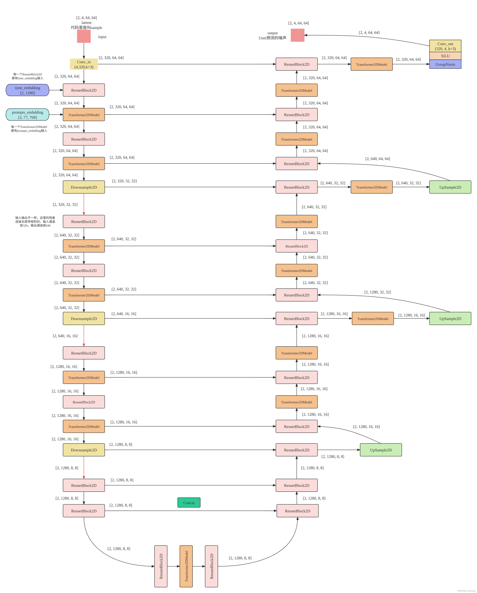

## **📌 `WebVid10M` (dataset.py)**
- **Input**:
  - Videos (`.mp4`) with paths read from a `CSV` file.
- **Processing**:
  - **Video Mode**: Randomly samples `16` frames, shape `(16, 3, 256, 256)`.
  - **Image Mode**: Randomly selects `1` frame, shape `(3, 256, 256)`.
  - Normalization to `[-1, 1]` and data augmentation applied.
- **Output**:
  - `dict(pixel_values, text=name)`
  - **Video Batch**: `(B, 16, 3, 256, 256)`
  - **Image Batch**: `(B, 3, 256, 256)`

---
## 📌 `UNet3DConditionModel (unet.py)`

[architecture](model_summary.md)
* #### Stable Diffusion V1.5 Architecture

### 1. `Down Sample Process (unet.py)`

| Block Index | Block Type                 | Input Shape (B, C, T, H, W) | Final Output Shape (B, C', T, H', W') | Operations |
|------------|--------------------------|---------------------------|--------------------------------|------------|
| **0**      | `CrossAttnDownBlock3D`    | (B, 320, T, H, W)         | (B, 320, T, H/2, W/2)         | - 2 ResNetBlock3D + Transformer3DModel   - **Downsample3D (Conv stride=2)** |
| **1**      | `CrossAttnDownBlock3D`    | (B, 320, T, H/2, W/2)     | (B, 640, T, H/4, W/4)        | - 2 ResNetBlock3D + Transformer3DModel   - **Downsample3D (Conv stride=2)** |
| **2**      | `CrossAttnDownBlock3D`    | (B, 640, T, H/4, W/4)    | (B, 1280, T, H/8, W/8)        | - 2 ResNetBlock3D + Transformer3DModel   - **Downsample3D (Conv stride=2)** |
| **3**      | `DownBlock3D`             | (B, 1280, T, H/8, W/8)    | (B, 1280, T, H/8, W/8)        | - 2 ResNetBlock3D (**No Downsampling**) |

#### 1.1 `CrossAttnDownBlock3D (unet_blocks.py)`

| **Stage** | **Processing Module**        | **Input Shape**                  | **Output Shape**                 |
|----------|------------------------------|----------------------------------|----------------------------------|
| **1**    | **ResNetBlock3D**             | `(B, in_channels, D, H, W)`      | `(B, out_channels, D, H, W)`    |
|          | **Transformer3DModel**        | `(B, out_channels, D, H, W)`     | `(B, out_channels, D, H, W)`    |
|          | **Motion Module (if enabled)**| `(B, out_channels, D, H, W)`     | `(B, out_channels, D, H, W)`    |
| **2**    | **ResNetBlock3D**             | `(B, out_channels, D, H, W)`     | `(B, out_channels, D, H, W)`    |
|          | **Transformer3DModel**        | `(B, out_channels, D, H, W)`     | `(B, out_channels, D, H, W)`    |
|          | **Motion Module (if enabled)**| `(B, out_channels, D, H, W)`     | `(B, out_channels, D, H, W)`    |
| **Final**| **Downsample3D (if enabled)** | `(B, out_channels, D, H, W)`     | `(B, out_channels, D/2, H/2, W/2)` |

#### 1.2 `ResnetBlock3D (resnet.py)`

| **Layer**              | **Input Shape**         | **Operation**                     | **Output Shape**        |
|------------------------|------------------------|-----------------------------------|-------------------------|
| **Input Tensor**       | `(B, C, T, H, W)`      | -                                 | `(B, C, T, H, W)`       |
| **GroupNorm 1**        | `(B, C, T, H, W)`      | `InflatedGroupNorm`               | `(B, C, T, H, W)`       |
| **Activation**         | `(B, C, T, H, W)`      | `SiLU`                            | `(B, C, T, H, W)`       |
| **Conv3D-1**          | `(B, C, T, H, W)`      | `InflatedConv3D (3x3 kernel)`     | `(B, C_out, T, H, W)`   |
| **Time Embedding**     | `(B, T_emb)`           | `Linear`                          | `(B, C_out)`            |
| **Broadcast T_emb**    | `(B, C_out)`           | `Expand to (B, C_out, 1, 1, 1)`  | `(B, C_out, 1, 1, 1)`   |
| **Add Time Embedding** | `(B, C_out, T, H, W)`  | `+ Time Embedding`                | `(B, C_out, T, H, W)`   |
| **GroupNorm 2**        | `(B, C_out, T, H, W)`  | `InflatedGroupNorm`               | `(B, C_out, T, H, W)`   |
| **Activation**         | `(B, C_out, T, H, W)`  | `SiLU`                            | `(B, C_out, T, H, W)`   |
| **Dropout**            | `(B, C_out, T, H, W)`  | `Dropout`                         | `(B, C_out, T, H, W)`   |
| **Conv3D-2**          | `(B, C_out, T, H, W)`  | `InflatedConv3D (3x3 kernel)`     | `(B, C_out, T, H, W)`   |
| **Shortcut Connection**| `(B, C, T, H, W)`      | `InflatedConv3D (1x1) (if needed)`| `(B, C_out, T, H, W)`   |
| **Residual Addition**  | `(B, C_out, T, H, W)`  | `Input + Output`                  | `(B, C_out, T, H, W)`   |
| **Scaling Factor**     | `(B, C_out, T, H, W)`  | `/ output_scale_factor`           | `(B, C_out, T, H, W)`   |
| **Final Output**       | `(B, C_out, T, H, W)`  | -                                 | `(B, C_out, T, H, W)`   |

#### 1.3 `Transformer3DModel (attention.py)`

| **Stage**  | **Processing Module**             | **Input Shape**                   | **Output Shape**                 |
|-----------|----------------------------------|----------------------------------|----------------------------------|
| **1**     | **Input Tensor**                 | `(B, C, D, H, W)`                | `(B, C, D, H, W)`               |
| **2**     | **Reshape for 2D Processing**     | `(B, C, D, H, W)`                | `(B*D, C, H, W)`                |
| **3**     | **Normalization (GroupNorm)**     | `(B*D, C, H, W)`                 | `(B*D, C, H, W)`                |
| **4**     | **Linear Projection (if enabled)** | `(B*D, C, H, W)` or `(B*D, H*W, C)` | `(B*D, inner_dim, H, W)` or `(B*D, H*W, inner_dim)` |
| **5**     | **Transformer Blocks (Loop)**     | `(B*D, H*W, inner_dim)`           | `(B*D, H*W, inner_dim)`         |
| **6**     | **Reshape Back**                  | `(B*D, H*W, inner_dim)`           | `(B*D, inner_dim, H, W)`        |
| **7**     | **Linear Projection (if enabled)** | `(B*D, inner_dim, H, W)` or `(B*D, H*W, inner_dim)` | `(B*D, C, H, W)` |
| **8**     | **Residual Connection**           | `(B*D, C, H, W)`                 | `(B*D, C, H, W)`                |
| **9**     | **Reshape to 3D Format**          | `(B*D, C, H, W)`                 | `(B, C, D, H, W)`               |
| **Final** | **Output Tensor**                 | `(B, C, D, H, W)`                | `(B, C, D, H, W)`               |

### 2. `Up Sample Process (unet.py)`

#### 2.1 `Upsample3D (resnet.py)`

| **Stage** | **Processing Module**           | **Input Shape**                | **Output Shape**               |
|----------|---------------------------------|--------------------------------|--------------------------------|
| **1**    | **Input Tensor**                | `(B, C, D, H, W)`              | `(B, C, D, H, W)`              |
| **2**    | **Data Type Cast (if bfloat16)** | `(B, C, D, H, W)`              | `(B, C, D, H, W) (float32)`    |
| **3**    | **Contiguous Check (if batch ≥ 64)** | `(B, C, D, H, W)`        | `(B, C, D, H, W)`              |
| **4**    | **Nearest Neighbor Upsampling** | `(B, C, D, H, W)`              | `(B, C, D, 2H, 2W)`            |
| **5**    | **Conditional Output Resizing** | `(B, C, D, H, W)` or `(B, C, D, 2H, 2W)` | `(B, C, D, target_H, target_W)` |
| **6**    | **Data Type Cast (if needed)**  | `(B, C, D, H, W) (float32)`    | `(B, C, D, H, W) (bfloat16)`   |
| **7**    | **Conv3D (if enabled)**         | `(B, C, D, H, W)`              | `(B, C_out, D, H, W)`          |
| **Final**| **Output Tensor**               | `(B, C_out, D, H, W)`          | `(B, C_out, D, H, W)`          |
